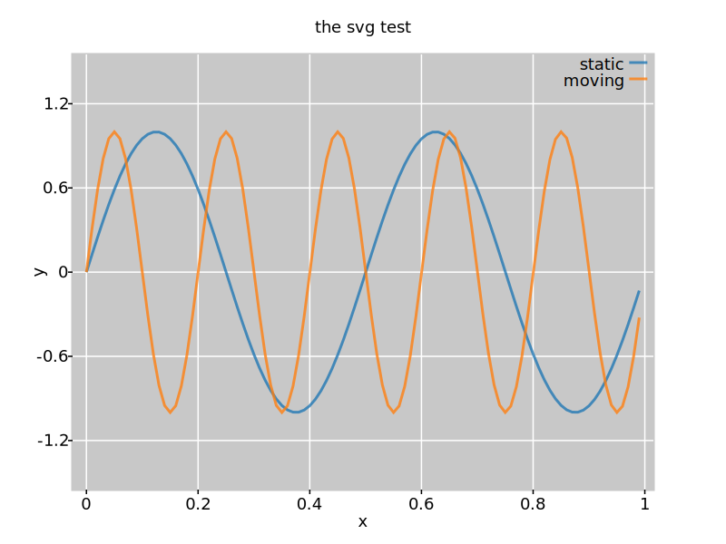

# trase

[](https://codecov.io/gh/martinjrobins/trase)
[](https://travis-ci.org/martinjrobins/trase)
[](https://ci.appveyor.com/project/martinjrobins/trase/branch/master)

Trase is a lightweight scientific plotting library for C++ with animation 
support. It enables you to construct plots, and display them via the OpenGL 
interface, or write them out to animated SVG files. 

For example, the following code writes out an SVG files showing a static plot of 
$y=sin(x)$, and a dynamic plot of $y=sin(\theta x)$ for $1 < \theta < 5$.

```cpp
  auto fig = figure();
  auto ax = fig->axis();
  const int n = 100;
  std::vector<float> x(n);
  std::vector<float> y(n);
  for (int i = 0; i < n; ++i) {
    x[i] = static_cast<float>(i) * 6.28 / n;
    y[i] = std::sin(x[i]);
  }
  auto static_plot = ax->plot(x, y);
  auto moving_plot = ax->plot(x, y);
  float time = 0.0;

  auto do_plot = [&](const float theta) {
    for (int i = 0; i < n; ++i) {
      y[i] = std::sin(theta * x[i]);
    }
    time += 0.3;
    moving_plot->add_frame(x, y, time);
  };

  for (int i = 1; i < 6; ++i) {
    do_plot(i);
  }
  for (int i = 5; i >= 1; --i) {
    do_plot(i);
  }

  std::ofstream out;
  out.open("test_figure.svg");
  BackendSVG backend(out);
  fig->serialise(backend);
  out.close();
```

This results in the following SVG:


